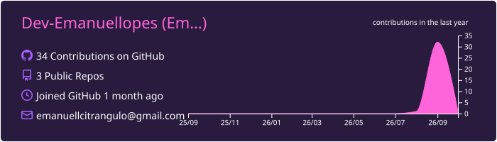
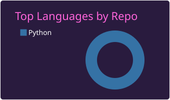
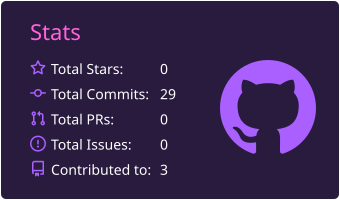
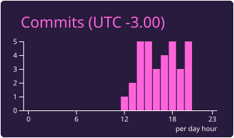

# 👨‍💻 Emanuel Lopes
**`Estudante de Python`**

Me chamo Emanuel Lopes Citrangulo, tenho 15 anos e sou natural do Rio de Janeiro. Atualmente, estou cursando o 9º ano do Ensino Fundamental no Colégio dos Santos Anjos. Sou um entusiasta em tecnologia e demonstro meu conhecimento através do Github. Mostro um pouco mais da minha vida no Instagram "[_pvddocici](https://www.instagram.com/_pvddocici)", onde além de iniciante em programação, também sei solucionar alguns cubos mágicos e pratico artes marciais desde meus 5 anos. Recentemente, concluí meu primeiro passo como Desenvolvedor: o Mundo 1 de Python do Professor Gustavo Guanabara!

### 🤖 Linguagens e Tecnologias

 
 

### 🤖 Github Stats

<table>
  <tr>
    <td>
      
    </td>
    <td>
      
    </td>
  </tr>
  <tr>
    <td>
      
    </td>
    <td>
      
    </td>
  </tr>
  <tr>
    <td colspan="2">
      
    </td>
  </tr>
</table>
